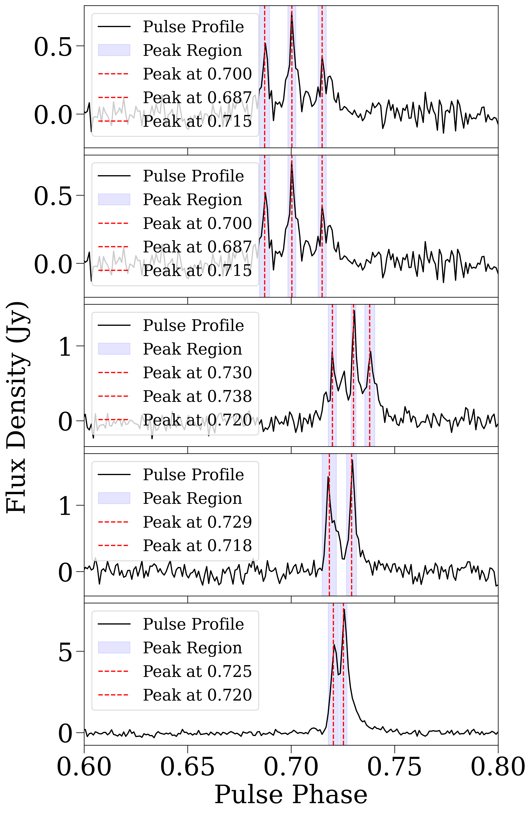
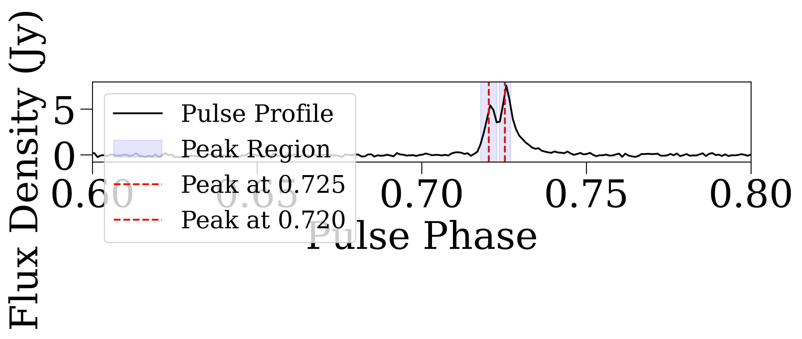

# Multi-Peak Pulse Analysis

This repository contains a Python script for detecting and visualizing multiple pulse components in pulsar profiles using PSRCHIVE archives. It is designed for use in fast radio burst (FRB) or pulsar studies. For more details, please refer to Ho et al. 2025, MNRAS, Section 3.4.

## Features

- Background subtraction and noise estimation
- Peak detection and multi-component fitting
- S/N thresholding
- Automatic plotting with peak annotations
- List of the peak positions and snr in .tsv

## Requirements

Install dependencies using:

```bash
pip install -r requirements.txt
```

## Usage

Put your `.ar` files in a directory, and use a `.cat` TSV catalog with a `#filename` column and `snr_xprof` values.

Run the script:

```bash
python scripts/detect_multipeak_pulses.py
```

Plots will be saved to `testplots`.

Example plot and tsv



`filename	snr_1	phase_1	snr_2	phase_2	snr_3	phase_3	snr_4	phase_4
/fred/oz002/users/sho/J1823-3021A/aug20_470s/pulse_80930966750.fluxcal	17.012	0.900	12.121	0.887	8.192	0.915		
/fred/oz002/users/sho/J1823-3021A/aug20_470s/pulse_80930966750.fluxcal	17.012	0.900	12.121	0.887	8.192	0.915		
/fred/oz002/users/sho/J1823-3021A/oct16_100s_6/pulse_80931090161.fluxcal	21.096	0.930	20.790	0.938	16.115	0.920		
/fred/oz002/users/sho/J1823-3021A/oct16_100s_14/pulse_80931228719.fluxcal	25.125	0.929	24.283	0.918				
/fred/oz002/users/sho/J1823-3021A/aug4_210s/pulse_80930893251.fluxcal	113.767	0.925	85.953	0.920				
/fred/oz002/users/sho/J1823-3021A/aug4_210s/pulse_80930893251.fluxcal	113.767	0.925	85.953	0.920`
